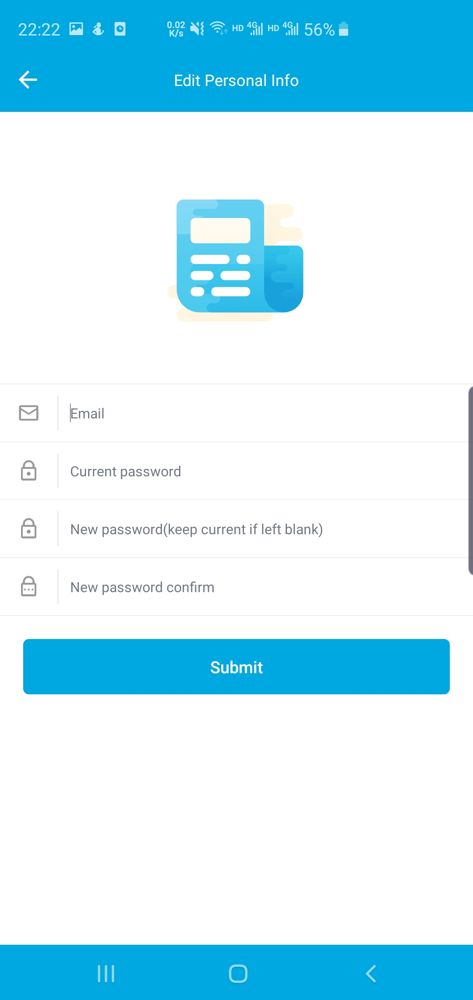

# Indulger

  

Indulger is a simple news app intended for those who enjoy an immersive style of reading. Unlike the name suggests, we don't want you to become a real indulger, yet instead you are encouraged to cultivate a good habit of reading and become more inquisitive about everything around you. Hope this app can get you well informed at least to some extent.

## Build

You can build this app via Android Studio/Idea, simply import the Gradle project

## Features

+ News browsering and channel(news category) editing
+ News sharing via WeChat/Weibo/Email
+ Add news to favorite list and view them offline
+ Proper caching of loaded news
+ Keyword-based news search and search history
+ Clear caches manually (this will not affect favorite news)
+ Video news based on Toutiao API
+ Keyword-based news recommendations/blockings

+ Multiple themes (default blue, Toutiao red and 9# green) are supported along with night mode
+ Multiple languages (currently Chinese Simplified and English) are supported
+ User register/login to sync favorite news

## Screenshots
|  |   |    |
| ------------------------------------------------------------ | ------------------------------------------------------------ | ------------------------------------------------------------ |
|  |  |  |
|  |     |  |

## Notes

All the libraries we use can be found in Gradle configuration files. Besides, we customized [QMUI](https://github.com/Tencent/QMUI_Android.git) and [SwitchButton](https://github.com/zcweng/SwitchButton.git) to fit our needs. We didn't make modifications to other libraries directly, however, they were sometimes inherited as subclasses to have their behaviors overridden. 

We did create some our own components that could be extracted as standalone packages, which are as follows:

+ `AutoWrapLayout` - A simple auto wrapping layout manager, used in search history fragment to properly display history tags whose length is dependent on the text contents and cannot be determined beforehand.
+ `BaseLazyLoadFragment` - A subclass of `Fragment`, implemented in a lazy load manner, in which case it will be loaded if and only if it becomes visible to user for the first time. This is used in home fragment to display news lists of different categories to ensure we don't fire multiple database or network queries, which can be a major cause of degraded performance.
+ `NestedWebView` - A `Webview` especially fit for `CoordinatorLayout`, which allows the tab bar to be hidden automatically when you scroll up, and show up once you scroll down a little bit. This is used in news detail page.
+ `ViewPagerBugFixed` - This `ViewPager` has fixed a bug in legacy one, which may cause trouble when you try some multi-touch gestures. One conspicuous fact is that the legacy one can crash image view in image detail page when you zoom in and out continuously and swiftly. We provided a solution by subclassing it and made some necessary changes.
+ `MutableFragmentPagerAdapter` - If you want to deal with fragments in `ViewPager`, Google would tell you `FragmentPagerAdapter` or `FragmentStatePagerAdapter` could do the work, and the latter one is more appropriate for scenarios where you have multiple fragments and the list of them is subject to frequent change. Unfortunately, when we tried to use the latter in our home fragment, we spotted some fundamental issues which can bring about miserable consequences such as incorrect order of fragments, initialization procedure of fragment not properly called or wrong fragment loaded, when you want to use it with a mutable fragment list(items can be popped out, inserted or swapped at any time), and the `notifyDatasetChanged` would just gives you a piece of junk in many cases. We worked out a solution using generic `PagerAdapter` directly. See implementation at [MutableFragmentPagerAdapter](app/src/main/java/com/inftyloop/indulger/adapter/MutableFragmentPagerAdapter.java).